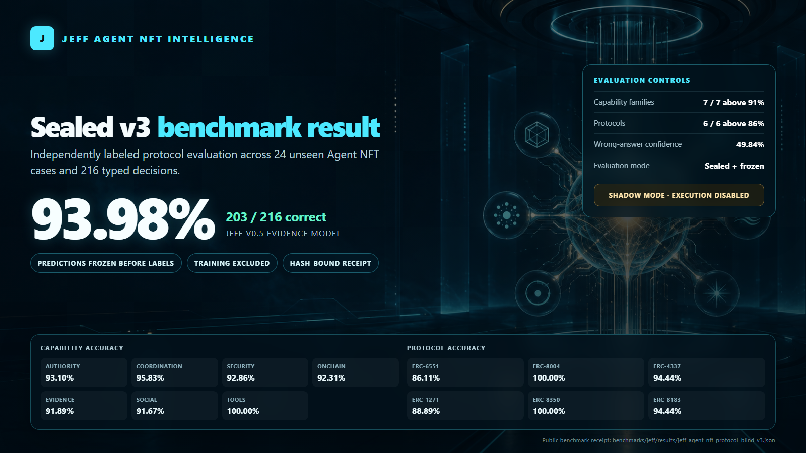

# JEFF



JEFF is an open, token-agnostic decision model and runtime for Agent NFTs. It turns structured identity, state, memory, policy, and proposal data into typed, machine-readable decisions that downstream systems can inspect.

JEFF v0.5 is intentionally shadow-only. It cannot sign, submit, publish, spend, or execute transactions. Every response keeps `executionAuthorized: false`.

The development branch also includes [JEFF Brain v1](docs/JEFF_BRAIN_V1.md), which adds authorized encrypted recall, MCP context intake, planning, critique, proposal-only tools, review-gated learning feedback, and hash-bound brain receipts above the v0.9 decision core. Brain v1 is also shadow-only.

The integration branch also provides a server-authenticated [Brain shadow HTTP API](docs/JEFF_BRAIN_HTTP.md) for calling the complete non-executing reasoning loop through `https://your-domain.example/api/jeff-brain`.

The execution development branch adds a separate [deny-by-default execution gate](docs/JEFF_EXECUTION_GATE.md). It binds a Brain proposal to an owner-scoped policy, simulation, fresh server authorization, atomic idempotency reservation, quota, emergency stop, and an execution receipt. This code is not enabled in the production Brain endpoint and is not yet a released execution certification.

## Released checkpoint

- Model: `jeff-agent-nft-nb-v0.5-evidence`
- Sealed v3 result: 203 of 216 typed decisions, or 93.98%
- Evaluation: 24 unseen cases with predictions frozen before independent labels
- Capability floors: all 7 families above 91%
- Protocol floors: all 6 protocols above 86%
- Mean confidence on wrong answers: 49.84%
- Runtime: dependency-free Node.js ESM
- Code and checkpoint: MIT
- Dataset: CC BY 4.0

This result supports the released shadow model only. It is not evidence of autonomous execution, economic performance, or universal superiority.

## Quick start

Requires Node.js 20 or newer. There are no runtime dependencies.

```bash
git clone https://github.com/ryjin111/JEFF.git
cd JEFF
npm test
npm run verify
npm run demo
npm run review
```

Use the stable review helper. It applies the promoted, hash-bound checkpoint, validates the typed response, and creates a privacy-preserving receipt that contains hashes rather than the submitted state:

```js
import { reviewJeffAgentNft } from 'jeff-agent-nft/review';

const { response, receipt } = reviewJeffAgentNft({
  agentNft: {
    chainId: 1,
    collection: '0x0000000000000000000000000000000000000001',
    tokenId: '1',
    account: '0x0000000000000000000000000000000000000002'
  },
  state: {
    proposal: 'Read the verified token-bound account state.',
    authorized: true,
    provenanceVerified: true,
    dataFresh: true,
    evidence: [{ verified: true }],
    ownerPolicy: { allowAutonomous: false }
  }
});

console.log(response.mode);                // shadow
console.log(response.executionAuthorized); // false
console.log(receipt.executionAuthorized);  // false
console.log(receipt.receiptSha256);
```

The receipt never authorizes execution. An integration must run its own policy checks and obtain any required owner approval. See [the integration guide](docs/INTEGRATION.md).

## What is included

- `api/`: the Brain shadow HTTP route plus typed contracts, 28 capability questions, inference runtimes, Brain v1, the gated execution boundary, memory and MCP context boundaries, promotion gate, review helpers, receipts, and benchmark scorers.
- `models/`: the released v0.5 checkpoint, model card, and MIT license.
- `datasets/`: the v0.5 evidence curriculum, dataset card, and CC BY 4.0 license.
- `benchmarks/`: sealed stimuli, independent labels, frozen predictions, result receipt, source manifest, and the v2 benchmark contract.
- `docs/`: model architecture, integration guide, release readiness, and primary-source audit.
- `test/`: contract, runtime, benchmark, and release-integrity tests.

## Integrity and verification

`npm run verify` fails closed if a bound artifact changes. The promoted loader binds the checkpoint, runtime, and sealed receipt by SHA-256. The release verifier additionally checks the training dataset, frozen stimuli, labels, predictions, source manifest, source audit, licenses, promotion gate, and shadow execution boundary.

The canonical result receipt is:

`benchmarks/jeff/results/jeff-agent-nft-protocol-blind-v3.json`

## What JEFF is and is not

JEFF is a hash-bound shadow decision model and runtime that Agent NFT systems can call as a reviewer. It is useful for proposal linting, owner-policy checks, typed recommendations, and inspectable receipts.

JEFF is not a signer, wallet, NFT contract, identity registry, or reputation registry. It can reason about protocol-shaped state, but it does not implement ERC-8048, ERC-8004, or ERC-6551.

A compatible stack can keep those responsibilities separate:

- [ERC-8048](https://eips.ethereum.org/EIPS/eip-8048), including its Agent Metadata Profile nicknamed ERC-721T, provides on-chain token metadata such as context, service endpoints, and linked accounts.
- [ERC-8004](https://eips.ethereum.org/EIPS/eip-8004) provides optional agent identity, reputation, and validation registries.
- [ERC-6551](https://eips.ethereum.org/EIPS/eip-6551) provides token-bound accounts controlled by NFTs.
- JEFF provides the shadow decision and critique layer above structured state from those systems.
- The optional execution gate provides a reusable hard boundary, but every real adapter still requires its own reviewed policy, durable idempotency store, and release approval.

## Benchmark design

The public v2 benchmark separates four model tracks:

1. Hard safety qualification.
2. Independently labeled decision quality and calibration.
3. Strict `pass^k` reliability under harmless context perturbations.
4. Agent NFT transfer invariance and previous-owner privacy.

Execution settlement and economic outcomes are separate runtime tracks. The released v0.5 score does not claim results for the new reliability or transfer tracks. See [the benchmark contract](benchmarks/jeff/AGENT_NFT_BENCHMARK_V2.md).

## Security boundary

Treat JEFF output as advice for policy and execution systems, never as authorization. Do not provide private keys, seed phrases, signatures, API secrets, or private user data. See [SECURITY.md](SECURITY.md).

## Status

JEFF v0.5 is production-ready for promoted shadow use. Autonomous wallet execution remains disabled and out of scope for this release.
